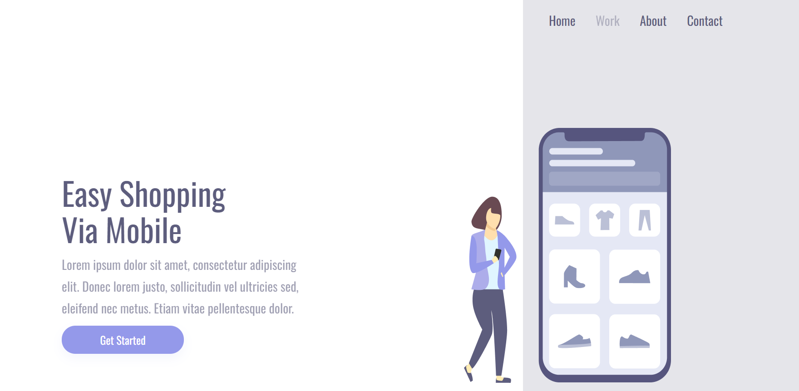
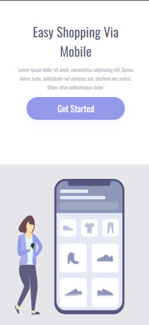

<h1>
Easy Shopping
</h1>

<h2>
📕 Sobre o projeto 
</h2>

Esse projeto foi desenvolvido durante as aulas do DevClub. Nele colocamos em prática o conhecimento sobre responsividade adquirido nas aulas do módulo de CSS.

<h2>
🔨 Ferramentas
</h2> 

<ul>
<li>HTML</li>
<li>CSS</li>
</ul>

<h2>Desktop</h2>

<h2>Mobile</h2>

